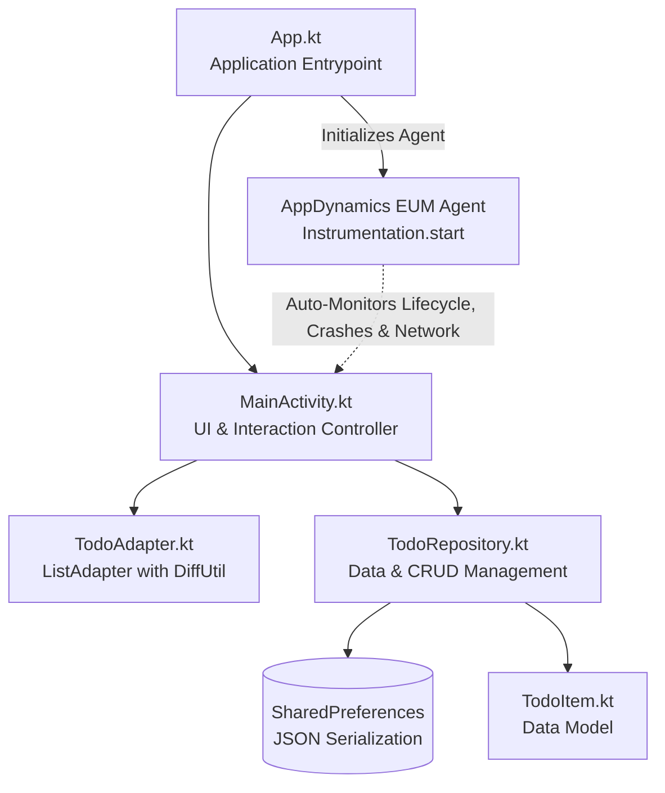

# AppDynamics Android Agent & Application Instrumentation Guide

This document details the software stack, architecture, and step-by-step configuration required to instrument the Android application with the **AppDynamics End-User Monitoring (EUM) Android Agent**.

---

## 1. Software Stack & Versions

| Component | Identifier / Artifact | Version | Notes |
| :--- | :--- | :--- | :--- |
| **Programming Language** | Kotlin (`kotlin-android`) | `2.4.10` | Modern Kotlin stdlib and coroutine support |
| **Java / JVM Target** | JDK / JVM | `17` | `sourceCompatibility = JavaVersion.VERSION_17`, `jvmTarget = '17'` |
| **Build Automation** | Gradle Wrapper | `8.13` | Configured in `gradle-wrapper.properties` |
| **Android Gradle Plugin (AGP)** | `com.android.tools.build:gradle` | `8.13.2` | Android build tools pipeline |
| **AppDynamics Gradle Plugin** | `com.appdynamics:appdynamics-gradle-plugin` | `26.8.0` | Injects bytecode instrumentation at compile/dex time |
| **AppDynamics Android SDK** | `adeum` | `26.8.0` | EUM Agent runtime |
| **Compile SDK Version** | Android SDK | `35` (Android 15) | Build target |
| **Target SDK Version** | Android SDK | `35` (Android 15) | Runtime behavior target |
| **Min SDK Version** | Android SDK | `23` (Android 6.0) | Minimum supported Android OS |
| **Build Tools Version** | `buildToolsVersion` | `35.0.0` | Android build toolchain |

### Key Libraries & Networking
- `com.squareup.okhttp3:okhttp:4.9.1` (HTTP client auto-instrumented by AppDynamics ADEUM)
- `org.jetbrains.kotlinx:kotlinx-coroutines-android:1.5.2` (Asynchronous task dispatching)
- `androidx.lifecycle:lifecycle-runtime-ktx:2.3.1` (`lifecycleScope` coroutine support)
- `androidx.core:core-ktx:1.5.0`
- `androidx.appcompat:appcompat:1.3.0`
- `com.google.android.material:material:1.3.0`
- `androidx.constraintlayout:constraintlayout:2.0.4`

---

## 2. Application Architecture Overview

The application follows a clean layered Android architecture with built-in instrumentation:



- **Application Lifecycle Layer (`App.kt`)**: Extends `android.app.Application`. Starts the AppDynamics Agent before any activity or component loads.
- **UI & Presentation Layer (`MainActivity.kt`, `TodoAdapter.kt`)**: Displays tasks, manages filter states (All / Active / Completed), handles add/edit/delete dialogs, and renders realtime task metrics.
- **Data & Repository Layer (`TodoRepository.kt`)**: Handles CRUD operations and persists tasks locally via `SharedPreferences` with JSON serialization.
- **Model Layer (`TodoItem.kt`)**: Immutable/mutable task data representation with UUID identification, timestamping, and JSON transformation methods.

---

## 3. Step-by-Step AppDynamics Instrumentation Configuration

Follow these steps to instrument the Android application with the AppDynamics Android Agent.

### Step 1: Add AppDynamics Gradle Plugin to Root `build.gradle`

In the root project [build.gradle](file:///Users/garychew/Documents/poc/Sample-Android-Application/build.gradle), declare the AppDynamics version and add the plugin to the `buildscript` classpath:

```groovy
buildscript {
    ext {
        kotlin_version = "2.4.10"
        appdynamics_version = "26.8.0"
    }
    repositories {
        google()
        mavenCentral()
    }
    dependencies {
        classpath 'com.android.tools.build:gradle:8.13.2'
        classpath "org.jetbrains.kotlin:kotlin-gradle-plugin:$kotlin_version"
        // AppDynamics Gradle Plugin
        classpath "com.appdynamics:appdynamics-gradle-plugin:$appdynamics_version"
    }
}
```

---

### Step 2: Configure EUM Account Properties (`appdynamics.properties`)

Create an [appdynamics.properties](file:///Users/garychew/Documents/poc/Sample-Android-Application/appdynamics.properties) file in the root directory to store your AppDynamics EUM account credentials:

```properties
EUM_ACCOUNT_NAME="<YOUR_EUM_ACCOUNT_NAME>"
EUM_LICENSE_KEY="<YOUR_EUM_LICENSE_KEY>"
```

> [!TIP]
> Keep `appdynamics.properties` outside version control in production environments or inject credentials via CI/CD environment variables.

---

### Step 3: Apply the `adeum` Plugin in App Module `app/build.gradle`

In [app/build.gradle](file:///Users/garychew/Documents/poc/Sample-Android-Application/app/build.gradle):

1. Apply the `adeum` plugin.
2. Load the credentials from `appdynamics.properties`.
3. Add the `adeum` configuration block.

```groovy
plugins {
    id 'com.android.application'
    id 'kotlin-android'
    id 'adeum' // AppDynamics Plugin
}

def appDynamicsPropertiesFile = rootProject.file("appdynamics.properties")
def appDynamicsProperties = new Properties()
if (appDynamicsPropertiesFile.exists()) {
    appDynamicsProperties.load(new FileInputStream(appDynamicsPropertiesFile))
}

android {
    namespace "com.appdynamics.sampleandroidapplication"
    compileSdkVersion 35
    buildToolsVersion "35.0.0"
    
    defaultConfig {
        applicationId "com.appdynamics.sampleandroidapplication"
        minSdkVersion 23
        targetSdkVersion 35
        versionCode 1
        versionName "1.0"
    }
    
    compileOptions {
        sourceCompatibility JavaVersion.VERSION_17
        targetCompatibility JavaVersion.VERSION_17
    }
    kotlinOptions {
        jvmTarget = '17'
    }
}

// AppDynamics configuration block
adeum {
    account {
        name appDynamicsProperties['EUM_ACCOUNT_NAME']
        licenseKey appDynamicsProperties['EUM_LICENSE_KEY']
    }
}
```

---

### Step 4: Configure Permissions & Application Class in `AndroidManifest.xml`

In [app/src/main/AndroidManifest.xml](file:///Users/garychew/Documents/poc/Sample-Android-Application/app/src/main/AndroidManifest.xml):

1. Grant `INTERNET` and `ACCESS_NETWORK_STATE` permissions so the agent can upload metrics and monitor connection states.
2. Register the custom Application class (`android:name=".App"`).

```xml
<?xml version="1.0" encoding="utf-8"?>
<manifest xmlns:android="http://schemas.android.com/apk/res/android">

    <!-- Permissions required by AppDynamics EUM Agent -->
    <uses-permission android:name="android.permission.INTERNET" />
    <uses-permission android:name="android.permission.ACCESS_NETWORK_STATE" />

    <application
        android:name=".App"
        android:allowBackup="true"
        android:icon="@mipmap/ic_launcher"
        android:label="@string/app_name"
        android:roundIcon="@mipmap/ic_launcher_round"
        android:supportsRtl="true"
        android:theme="@style/Theme.SampleAndroidApplication">
        
        <activity
            android:name=".MainActivity"
            android:exported="true">
            <intent-filter>
                <action android:name="android.intent.action.MAIN" />
                <category android:name="android.intent.category.LAUNCHER" />
            </intent-filter>
        </activity>
    </application>

</manifest>
```

---

### Step 5: Configure App Key & Collector URL in Resources

Store the EUM App Key and Collector URL in [app/src/main/res/values/secrets.xml](file:///Users/garychew/Documents/poc/Sample-Android-Application/app/src/main/res/values/secrets.xml) (or `strings.xml`):

```xml
<?xml version="1.0" encoding="utf-8"?>
<resources>
    <string name="APP_KEY">AD-AAB-AEA-YDP</string>
    <string name="COLLECTOR_URL">https://col.eum-appdynamics.com</string>
</resources>
```

---

### Step 6: Initialize the Agent in `App.kt`

In [app/src/main/java/com/appdynamics/sampleandroidapplication/App.kt](file:///Users/garychew/Documents/poc/Sample-Android-Application/app/src/main/java/com/appdynamics/sampleandroidapplication/App.kt), initialize the agent in `onCreate()`:

```kotlin
package com.appdynamics.sampleandroidapplication

import android.app.Application
import com.appdynamics.eumagent.runtime.AgentConfiguration
import com.appdynamics.eumagent.runtime.Instrumentation

class App : Application() {
    override fun onCreate() {
        super.onCreate()

        // Initialize AppDynamics Android Agent
        Instrumentation.start(
            AgentConfiguration.builder()
                .withAppKey(getString(R.string.APP_KEY))
                .withContext(applicationContext)
                .withCollectorURL(getString(R.string.COLLECTOR_URL))
                .withLoggingLevel(Instrumentation.LOGGING_LEVEL_VERBOSE)
                .build()
        )
    }
}
```

---

## 4. Verification & Diagnostics

To verify that the AppDynamics instrumentation is functioning properly:

1. **Check Build Output**:
   Run `./gradlew assembleDebug`. Ensure the `adeum` plugin executes byte-code transformation tasks without errors.
2. **Inspect Logcat Runtime Logs**:
   Filter Logcat output with the tag `ADEUM` or `AppDynamics`:
   ```bash
   adb logcat -s ADEUM
   ```
   You should see messages confirming successful agent initialization and beacon transmission to `https://col.eum-appdynamics.com`.
3. **Verify in AppDynamics Controller**:
   Navigate to **User Experience** > **Mobile Applications** in the AppDynamics Controller to view active sessions, network requests, and crash analytics.

## 5. Build files
The app uses **Groovy DSL** for its build files.

### Indicators:
- **File Extensions**: The build files use the standard `.gradle` extension ([`build.gradle`](file:///Users/garychew/Documents/poc/Sample-Android-Application/build.gradle), [`settings.gradle`](file:///Users/garychew/Documents/poc/Sample-Android-Application/settings.gradle), [`app/build.gradle`](file:///Users/garychew/Documents/poc/Sample-Android-Application/app/build.gradle)) rather than `.gradle.kts` (which is used for Kotlin DSL).
- **Syntax**: Uses Groovy syntax such as:
  - `def appDynamicsPropertiesFile = rootProject.file(...)`
  - `classpath 'com.android.tools.build:gradle:8.13.2'`
  - Single-quoted string literals and dynamic property access (`appDynamicsProperties['EUM_ACCOUNT_NAME']`).


  ## 6. Network Request Verification
Unit Tests: Ran ./gradlew testDebugUnitTest — Passed.
Build: Ran ./gradlew assembleDebug — BUILD SUCCESSFUL.
ADEUM Monitoring: The adeum plugin instruments OkHttpClient calls, allowing network beacons to be automatically captured and reported in AppDynamics.